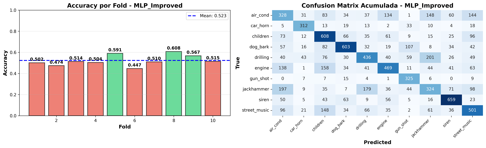
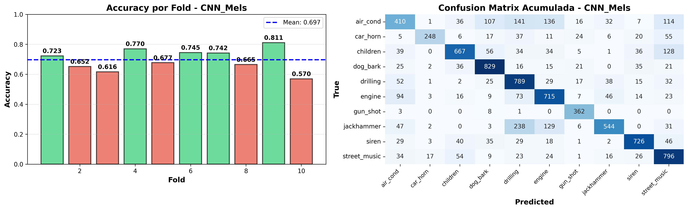

# 🎵 UrbanSound8K Classification: End-to-End Audio Analysis


## 📌 Executive Summary
This project implements an end-to-end Deep Learning pipeline to classify urban sounds using the **UrbanSound8K dataset**. By leveraging the **CRISP-DM methodology**, the project explores various feature extraction techniques (MFCCs, Mel-Spectrograms) and compares the performance of **MLP (Multi-Layer Perceptron)** and **CNN (Convolutional Neural Network)** architectures.

To ensure robust results and avoid data leakage due to the dataset's nature, a strict **10-Fold Cross-Validation** strategy based on the original paper's taxonomy was implemented.

---

## 🚀 Key Results
The Convolutional Neural Network (CNN) using Mel-Spectrograms achieved the best performance, significantly outperforming the baseline MLP model.

| Model Architecture | Feature Input | Accuracy |
| :--- | :--- | :--- |
| **CNN (2D)** | **Mel-Spectrograms** | **70%** (Best) |
| CNN (2D) | MFCCs | 66% |
| MLP (Baseline) | MFCCs | 52% |

*(Note: The CNN demonstrated superior capability in capturing spatial hierarchies in spectrogram data compared to the flat MLP structure, resulting in an 18% performance increase.)*

---

## 📊 Visual Analysis
### Model Performance (Confusion Matrices)
Below is a comparison of the classification performance between the baseline MLP and the improved CNN model.

| MLP Analysis | CNN (Mel-Spectrograms) Analysis |
| :---: | :---: |
|  |  |

> *The confusion matrices highlight which classes were most challenging. For instance, the models often confuse 'street_music' with 'children_playing' due to overlapping frequencies.*

---

## 🛠️ Methodology (CRISP-DM)

The project follows the **Cross-Industry Standard Process for Data Mining (CRISP-DM)**:

1.  **Business Understanding**: Defining the goal of classifying 10 different urban sound classes (air conditioner, car horn, children playing, etc.) to aid in noise pollution monitoring.
2.  **Data Understanding**: Analyzing the UrbanSound8K dataset structure, class distribution, and audio properties (sample rates, bit depths).
3.  **Data Preparation**:
    * **Audio Normalization**: Resampling to 22,050 Hz and mono conversion using `Librosa`.
    * **Feature Extraction**: Computing MFCCs (40 coefficients) and Mel-Spectrograms.
    * **Data Augmentation**: Techniques applied to balance class distribution.
4.  **Modeling**:
    * **MLP**: Dense layers with Dropout and Batch Normalization for baseline.
    * **CNN**: 2D Convolutional layers tailored for spectrogram image-like data.
5.  **Evaluation**: Using **10-Fold Cross-Validation** (respecting the pre-defined folds) to rigorously test generalization and prevent data leakage.

---

## 📂 Project Structure

```text
├── CNN_data/                # Results and logs for CNN models
│   ├── MFCC/                # Analysis using MFCC features
│   └── Mel_Spectrogram/     # Analysis using Mel-Spectrograms
├── MLP_improved_data/       # Results and plots for the MLP model
├── UrbanSound8K_Classification_Project.ipynb  # Main Jupyter Notebook
├── requirements.txt         # Project dependencies
└── README.md                # Project documentation
